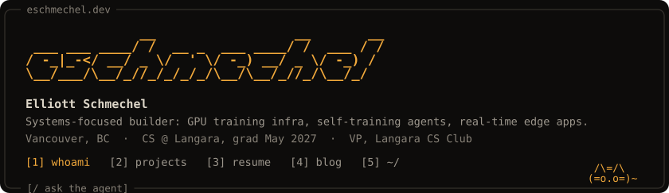

<a href="https://eschmechel.dev"></a>

### `[1] whoami`

I ship end to end across Go, C++, TypeScript and Python, from GPU training infrastructure and
self-training AI agents to real-time apps at the edge.

Most recently: an on-device lip-reading pipeline at StormHacks, a loop that turns an agent's
repeated work into small fine-tuned specialists, and a summer as a Technical Content Engineer at
LicenseSpring writing SDK samples and developer education. Final-year CS at Langara. Daily driver: Arch.

```text
 now
  building   the Langara CS Club website redesign
  building   a universal post-secondary Discord bot
  studying   final year of CS at Langara
```

### `[2] projects`

- **[heard](https://github.com/LMSAIH/stormhacks2026)** `StormHacks 2026 · team of 4`  
  Silent-speech app: reads your lips from a webcam and speaks for you. I built the on-device lip-reading pipeline (Auto-AVSR → ONNX, int8, 775 MB → 203 MB, in the browser) and the FastAPI GPU inference service on RunPod. · [devpost](https://devpost.com/software/heard-37hzow)

- **[hermes-apprentice](https://github.com/eschmechel/hermes-apprentice)** `winner · Hermes Agent Challenge`  
  A second learning loop for Hermes Agent: distills its recurring work into 18 MB QLoRA specialists on vLLM (~38 ms p50 local vs multi-second API calls), each gated by a held-out F1 test and a canary ramp. · [writeup](https://eschmechel.dev/blog/skills-are-prompts-heres-how-hermes-apprentice-turns-them-into-weights) · [devpost](https://devpost.com/software/hermes-apprentice)

### `[3] blog`
- [Your AI slop bores me](https://eschmechel.dev/blog/your-ai-slop-bores-me) <sub>· Jun 2026</sub>
- [Skills are Prompts. Here's how Hermes Apprentice turns them into weights](https://eschmechel.dev/blog/skills-are-prompts-heres-how-hermes-apprentice-turns-them-into-weights) <sub>· May 2026</sub>

### `[4] ~/`

```text
languages   Go · C++ · Python · TypeScript · SQL · Bash
backend     Hono · FastAPI · Next.js · Drizzle · PostgreSQL
infra       Docker · Kubernetes · Proxmox · Firecracker · Cloudflare Workers/D1 · GitHub Actions
ml / ai     LoRA fine-tuning (Unsloth) · local LLMs · MCP servers · RAG (Vectorize)
homelab     3 Proxmox nodes, live status on eschmechel.dev/~
```

<sub>[eschmechel.dev](https://eschmechel.dev) · [linkedin](https://linkedin.com/in/eschmechel) · [dev.to](https://dev.to/eschmechel)</sub>

```text
       _                        /\=/\
      (_)                      (=o.o=)
     /|_|\___________________  /     \
      | |                    \|_______|
     _| |_                    (o)   (o)
  ~~~~~~~~~~~~~~~~~~~~~~~~~~~~~~~~~~~~~~~~~
```
